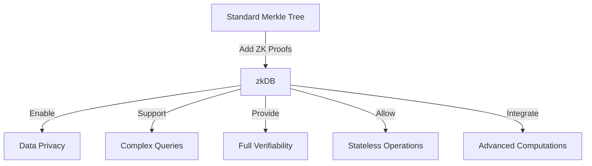
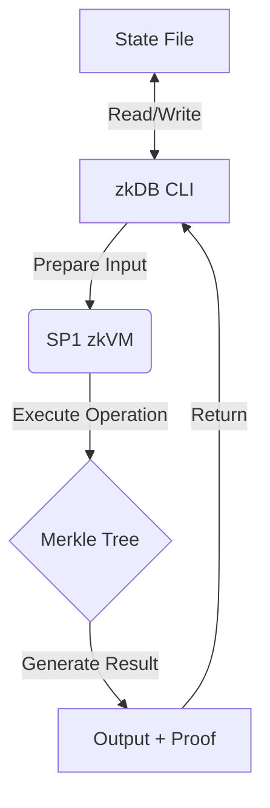

# zkDB: Zero-Knowledge Database 🧠

## Reflection on the Future of Blockchain Development

Before diving into the technical details of zkDB, it's crucial to consider the broader context of blockchain development and its future direction. There's a growing recognition in the blockchain community that current blockchain virtual machines (EVMs, SVMs, Move, etc.) may not be sufficient to achieve feature parity with Web2 applications or to fully realize the potential of trustless applications.

This limitation points to an increasing need for off-chain services and computation. As blockchain platforms evolve, we're likely to see a shift towards:

1. A greater emphasis on off-chain services to extend blockchain capabilities.
2. Simpler tools and frameworks for building these off-chain services.
3. Blockchain networks optimizing for throughput and scale, while relying on off-chain services for complex computations.
4. Increased demand for developers skilled in building hybrid systems that leverage both on-chain and off-chain components.

zkDB is positioned at the forefront of this trend. By combining the security of Merkle trees, the efficiency of off-chain computation, and the verifiability of zero-knowledge proofs, zkDB demonstrates how we can build powerful, scalable systems that extend beyond the limitations of traditional blockchain VMs.

---

## What is zkDB?

zkDB is a Merkle tree-based database utilizing the [SP1](https://succinct.xyz) zkVM for secure and efficient operations. It supports ```insert```, ```query```, and ```prove``` commands, providing a foundation for verifiable data storage and retrieval.

## How It Works

zkDB combines the power of Merkle trees with zero-knowledge proofs to create a verifiable database system. Here's a high-level overview of its operation:

1. **Data Storage**: When data is inserted, it's stored as leaves in a Merkle tree.
2. **Merkle Tree**: The Merkle tree provides an efficient way to cryptographically verify the integrity of large datasets.
3. **Zero-Knowledge Proofs**: Using SP1 zkVM, the system can generate proofs of data inclusion without revealing the actual data.
4. **Verifiable Queries**: Users can query data and receive both the result and a proof of its correctness.

## How zkDB Enhances Standard Merkle Trees

zkDB builds on Merkle trees, adding crucial features:

1. **Zero-Knowledge Proofs**: Prove data operations without revealing content.
2. **Complex Queries**: Go beyond simple inclusion proofs.
3. **Full Verifiability**: Every action (insert, query, prove) generates a proof.
4. **Stateless Design**: Entire database state can be serialized, enabling unique distributed use cases.
5. **zkVM Integration**: Allows for advanced computations while maintaining verifiability.

These additions transform zkDB from a simple Merkle tree into a powerful, privacy-preserving database system with broad applications in trustless environments.



## How zkDB Differs from Standard Merkle Trees

While zkDB builds upon the foundation of Merkle trees, it extends their capabilities in several key ways:

1. **Zero-Knowledge Proofs**: Unlike standard Merkle trees, zkDB integrates with the SP1 zkVM to generate zero-knowledge proofs. This allows for verifiable computations without revealing the underlying data.

2. **Stateless Execution**: zkDB is designed for stateless execution within the zkVM environment. The entire state is serialized and deserialized between operations, allowing for verifiable state transitions.

3. **Complex Operations**: While Merkle trees typically offer simple inclusion proofs, zkDB can support more complex operations and queries, all of which can be proven in zero-knowledge.

4. **Verifiable Queries**: In addition to proving inclusion, zkDB can prove the correctness of query results without revealing the actual data.

5. **Integration with zkVM**: The use of SP1 zkVM allows for arbitrary computations on the data, not just simple lookups. This enables more sophisticated database operations while maintaining verifiability.

6. **Proof Generation for All Operations**: Every operation (insert, query, prove) can generate a proof, not just inclusion proofs as in standard Merkle trees.

7. **Serializable State**: The entire database state, including the Merkle tree structure, is serialized and can be passed around or stored externally, enabling unique use cases in distributed systems.

These features make zkDB more than just a Merkle tree implementation. It's a full-fledged verifiable database system that leverages zero-knowledge proofs to provide enhanced privacy and verifiability for complex operations.

### Process Flow



1. The zkDB CLI prepares the input for the SP1 zkVM.
2. The zkVM executes the requested operation on the Merkle tree.
3. Results and proofs are generated.
4. The output is returned to the CLI.
5. State is maintained between operations using a local file.

## Key Concepts

- **Merkle Tree**: A tree in which every leaf node is labelled with the cryptographic hash of a data block, and every non-leaf node is labelled with the cryptographic hash of the labels of its child nodes.
- **Zero-Knowledge Proofs**: Cryptographic methods by which one party can prove to another party that they know a value x, without conveying any information apart from the fact that they know the value x.
- **SP1 zkVM**: A zero-knowledge virtual machine that allows for the creation and verification of proofs for arbitrary computations.

## Use Cases

- **Verifiable Data Storage**: Ensure data integrity in distributed systems.
- **Privacy-Preserving Queries**: Prove data existence without revealing the data itself.
- **Audit Trails**: Create verifiable logs of data operations.
- **Decentralized Applications**: Build trustless systems with verifiable state transitions.

## Prerequisites

- Rust and Cargo (latest stable version)
- SP1 zkVM toolchain

## Building the Project

1. Clone the repository and navigate to the project directory:

   ```
   git clone <repository-url>
   cd zkdb
   ```

2. Build the project in release mode:

   ```
   cargo build --release
   ```

   *Note: It's crucial to use the ```--release``` flag when building, as sp1-sdk must be built in release mode.*

## Using the zkDB Script

The zkDB script provides a command-line interface to interact with the Merkle tree database. Here's how to use it:

1. Ensure you're in the project root directory.

2. Run the script using Cargo in release mode:

   ```
   cargo run --release --bin merkle -- <command> [arguments]
   ```

   Replace ```<command>``` with one of the following: ```insert```, ```query```, or ```prove```.

   *Remember to always use the ```--release``` flag when running the script.*

### Commands

#### Insert

To insert a key-value pair:

```
cargo run --release --bin merkle -- insert <key> <value>
```

**Example:**

```
cargo run --release --bin merkle -- insert mykey myvalue
```

#### Query

To query a value by key:

```
cargo run --release --bin merkle -- query <key>
```

**Example:**

```
cargo run --release --bin merkle -- query mykey
```

#### Prove

To generate a proof for a key:

```
cargo run --release --bin merkle -- prove <key>
```

**Example:**

```
cargo run --release --bin merkle -- prove mykey
```

### Generating SP1 Proofs

To generate and verify an SP1 proof along with any command, add the ```--prove``` flag:

```
cargo run --release --bin merkle -- <command> [arguments] --prove
```

**Examples:**

```
cargo run --release --bin merkle -- insert mykey myvalue --prove
cargo run --release --bin merkle -- query mykey --prove
cargo run --release --bin merkle -- prove mykey --prove
```

These commands will execute the respective operations and also generate and verify an SP1 proof.

### State Management

The script automatically manages the state of the Merkle tree. The state is passed between operations as a base64-encoded JSON string. This allows for stateless execution of the zkVM program while maintaining continuity between commands.

## Project Structure

- ```src/main.rs```: Contains the main zkVM program logic for Merkle tree operations.
- ```src/bin/merkle.rs```: Implements the command-line interface for interacting with the zkVM program.
- ```tests/integration_tests.rs```: Contains integration tests for the zkVM program.
- ```script/src/bin/db.rs```: [Describe purpose or remove if unused]
- ```script/merkle_state.txt```: Stores the current state of the Merkle tree.
- ```.env.example```: Example environment variables configuration.
- ```README.md```: Project documentation.

## Running Tests

To run the integration tests:

```
cargo test
```

This will execute the tests defined in ```tests/integration_tests.rs```.

## Implementation Details

- The project uses the ```rs_merkle``` crate for Merkle tree operations.
- The ```sp1-zkvm``` crate is used for zkVM-specific functionality.
- State is serialized and deserialized using ```serde_json``` and ```base64``` encoding.

## Benchmark Results

Here are the benchmark results for the main operations:

```
+-----------+--------+--------------+-------------+
| Operation | Cycles | Total Time   | Avg Time    |
+-----------+--------+--------------+-------------+
| insert    | 44453  | 1.076435122s | 10.764351ms |
+-----------+--------+--------------+-------------+
| query     | 19995  | 1.038018872s | 10.380188ms |
+-----------+--------+--------------+-------------+
| prove     | 20024  | 1.059557666s | 10.595576ms |
+-----------+--------+--------------+-------------+
```

These results show the number of cycles, total time, and average time for each operation over 100 iterations.

## Future Enhancements

- Implement batch operations for improved efficiency.
- Add support for more complex query types.
- Integrate with distributed storage systems.
- Develop a high-level API for easier integration with other applications.

## Note

This project is a demonstration of using SP1 zkVM for Merkle tree operations. It's not intended for production use without further security audits and optimizations.

## Contributing

Contributions are welcome! Please feel free to submit a Pull Request.

## License

MIT
