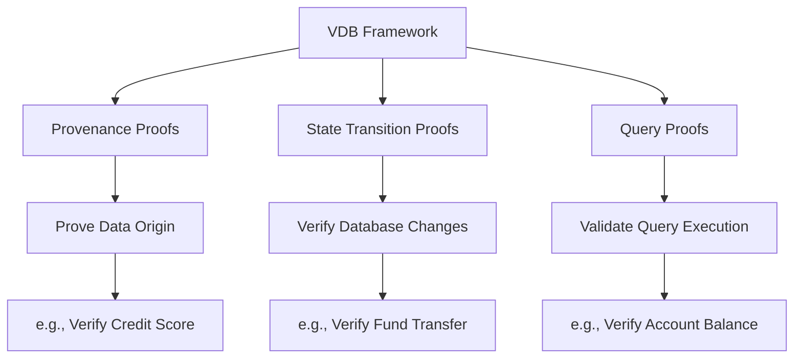

# What is the Verifiable Database (VDB) Framework?

## Preamble: Understanding Blockchain

Before diving into the VDB Framework, let's briefly explain what a blockchain is and why it's important:

A blockchain is a decentralized, digital ledger that records transactions across many computers. Its key features are:

1. **Decentralization**: No single entity controls the entire network.
2. **Transparency**: All transactions are visible to everyone on the network.
3. **Immutability**: Once recorded, data cannot be altered without consensus.
4. **Security**: Cryptographic techniques ensure data integrity and authenticity.

Blockchains are used for various purposes, including:
- Cryptocurrencies (e.g., Bitcoin)
- Smart contracts (e.g., Ethereum)
- Supply chain tracking
- Voting systems
- Decentralized finance (DeFi)

The main goal of blockchain technology is to create trust in a trustless environment, enabling secure transactions and agreements without the need for intermediaries.

## Introduction to the VDB Framework

The Verifiable Database (VDB) Framework is a concept that bridges the gap between traditional databases and blockchain technology. It addresses key challenges in the blockchain space and provides solutions for businesses looking to leverage blockchain benefits without completely overhauling their existing systems.

## Why Do We Need the VDB Framework?

To understand the need for the VDB Framework, let's consider three key points:

1. **On-Chain State is Expensive**:
   - Storing data directly on a blockchain (on-chain) is costly and becomes more expensive as demand increases.
   - This makes it impractical for businesses to store large amounts of data or perform complex computations directly on the blockchain.

2. **Existing Businesses Have Off-Chain State**:
   - Most businesses already have established databases and systems that operate off the blockchain (off-chain).
   - Completely migrating these systems to the blockchain would be impractical, expensive, and often unnecessary.

3. **Crypto Rails Offer Great Distribution, But Are Hard to Capitalize On**:
   - Blockchain and cryptocurrency technologies provide excellent tools for distribution and decentralization.
   - However, it's challenging for businesses to take advantage of these benefits while maintaining their existing data structures and privacy requirements.

The VDB Framework aims to solve these issues by providing a middle ground—allowing businesses to keep their data off-chain while still benefiting from blockchain's verifiability and distribution capabilities.

## What Does the VDB Framework Do?

The VDB Framework combines traditional database functionalities with cryptographic proof systems. It allows you to:

1. **Keep Data Off-Chain**: Store your data in traditional, efficient database systems.
2. **Prove Data Operations**: Generate proofs about your data and operations without revealing the data itself.
3. **Verify On-Chain**: Use blockchain to verify these proofs, ensuring data integrity and operation correctness.

This approach gives you the best of both worlds: the efficiency and privacy of off-chain storage with the verifiability and trust of blockchain systems.

## Core Components of the VDB Framework

The VDB Framework consists of three main types of proofs:

1. **Provenance Proofs**: 
   - Prove where data came from without revealing the data itself.
   - *Example*: Prove a user's credit score is above 700 without revealing the exact score.

2. **State Transition Proofs**: 
   - Prove that database changes were made correctly.
   - *Example*: Prove that funds were transferred between accounts correctly without revealing account details.

3. **Query Proofs**: 
   - Prove that a database query was executed correctly and the result is accurate.
   - *Example*: Prove that a user's account balance is above a certain threshold without revealing the exact balance.

These proofs work together to ensure data integrity, privacy, and verifiability in the VDB Framework.

## How Can Businesses Use Verifiable DBs?

Here are some practical examples of how businesses might use a verifiable database:

1. **Financial Services**:
   - **Regulatory Compliance**: Prove compliance with financial regulations without revealing sensitive customer data.
   - **Transaction Integrity**: Verify that transactions are processed correctly without exposing account details.

2. **Supply Chain Management**:
   - **Product Provenance**: Prove the origin and journey of products without revealing proprietary supply chain data.
   - **Quality Assurance**: Verify that quality checks were performed correctly without exposing the details of the checks.

3. **Healthcare**:
   - **Patient Privacy**: Prove that a patient meets certain criteria for a study without revealing their medical records.
   - **Procedure Verification**: Ensure that proper medical procedures were followed without exposing patient data.

4. **Voting Systems**:
   - **Vote Integrity**: Prove that votes were counted correctly without revealing individual votes.
   - **Voter Eligibility**: Verify voter eligibility without exposing personal information.

By using verifiable databases, businesses can leverage the trust and verifiability of blockchain technology while maintaining the privacy and efficiency of their existing database systems.

## How Can Software Teams Use the VDB Framework?

The VDB Framework is primarily designed for software teams creating database technologies. Here's how they can leverage it:

1. **Developing New Database Systems**:
   - **Blueprint for Verifiability**: Use the VDB Framework as a guide to create databases with built-in verifiability features.
   - **Implementing Proofs**: Integrate the three types of proofs (Provenance, State Transition, and Query) into the database architecture.

2. **Enhancing Existing Databases**:
   - **Adding Verifiability**: Incorporate VDB concepts into existing database systems to introduce verifiability without overhauling the entire system.
   - **Middleware Development**: Create middleware solutions that interface between traditional databases and blockchain systems, embedding VDB principles.

3. **Building Blockchain Bridges**:
   - **Secure Interactions**: Develop interfaces that allow traditional databases to interact securely with blockchain systems.
   - **Proof Generation and Verification**: Create APIs and tools that handle the generation and verification of proofs for database operations.

4. **Creating Development Tools**:
   - **Libraries and SDKs**: Develop libraries and software development kits that simplify the implementation of VDB concepts for other developers.
   - **Testing Frameworks**: Build testing tools specifically designed for verifiable database systems to ensure correctness and security.

5. **Optimizing Performance**:
   - **Efficient Proof Algorithms**: Research and implement efficient algorithms for generating and verifying proofs to minimize performance overhead.
   - **Balancing Verifiability and Speed**: Develop strategies to manage the trade-off between the level of verifiability and system performance.

6. **Ensuring Compliance**:
   - **Data Protection Integration**: Implement features that help businesses comply with data protection regulations by leveraging the privacy features of verifiable databases.
   - **Audit Tools**: Create auditing tools that utilize the verifiability features of VDB-based systems to streamline compliance processes.

By using the VDB Framework, software teams can create robust, verifiable database solutions that offer enhanced security, privacy, and trust, catering to a wide range of applications that require reliable data management.

## Summary

The Verifiable Database (VDB) Framework provides a structured approach to integrating blockchain's trustless verifiability with traditional database systems' efficiency and privacy. By leveraging cryptographic proofs, VDBs enable businesses and software teams to achieve secure, private, and verifiable data operations without the high costs and complexities of on-chain storage.
