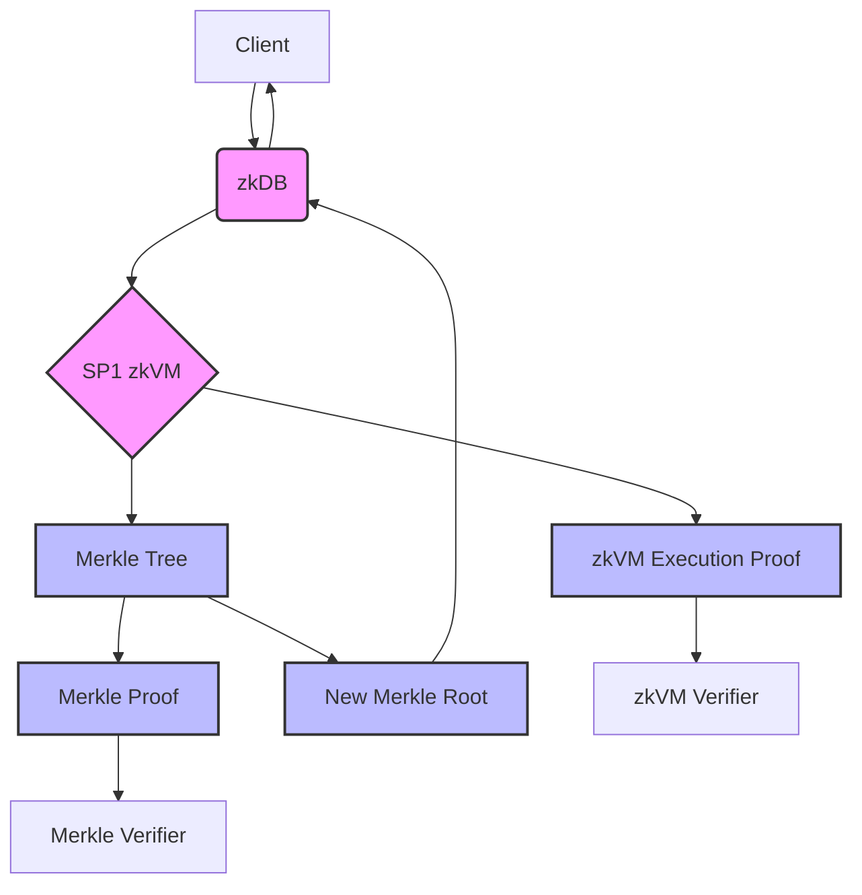
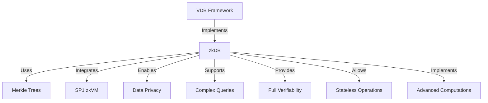

# Why zkDB?

## The Future of Blockchain Development

Blockchain technology is powerful, but current virtual machines (like EVMs, SVMs, and Move) have limitations. They struggle to offer the same features as traditional web applications. This means we need to look beyond the blockchain for more complex computations.

We're seeing a shift towards:

1. **Off-Chain Services**: Using services outside the blockchain to handle advanced tasks.
2. **Simpler Tools**: Creating easier ways to build these off-chain services.
3. **Improved Scalability**: Blockchains focusing on handling more transactions efficiently.
4. **Hybrid Systems**: Developers combining on-chain and off-chain components.

zkDB is at the forefront of this change, implementing the Verifiable Database (VDB) Framework. It combines secure Merkle trees, efficient off-chain computation, and zero-knowledge proofs. This allows us to build powerful systems beyond the limits of traditional blockchain virtual machines.

---

## What is zkDB?

zkDB is an implementation of the Verifiable Database (VDB) Framework that uses Merkle trees and the [SP1](https://succinct.xyz) zkVM for secure and efficient operations. It supports `insert`, `query`, and `prove` commands, providing a foundation for verifiable data storage and retrieval.

## How zkDB Implements the VDB Framework

zkDB realizes the core properties of the VDB Framework:

1. **Provenance Proofs**: Uses Merkle inclusion proofs for on-chain data and supports zkTLS for off-chain data sources.
2. **Recursive State Proofs**: Implements efficient state transition proofs using the SP1 zkVM.
3. **Query Proofs**: Generates verifiable proofs for all database operations.

## How zkDB Enhances Merkle Trees

zkDB adds important features to standard Merkle trees:

1. **Zero-Knowledge Proofs**: Keeps data private while proving information about it.
2. **Complex Queries**: Handles more than just simple checks.
3. **Full Verifiability**: Every action can be proven to be correct.
4. **Stateless Design**: The entire database can be saved and shared easily.
5. **zkVM Integration**: Allows advanced computations while staying secure.

These additions turn zkDB into a powerful, privacy-preserving database system suitable for trustless environments.

## How zkDB is Different from Standard Merkle Trees

Unlike regular Merkle trees, zkDB:

- **Uses Zero-Knowledge Proofs**: Proves data operations without revealing the data.
- **Supports Stateless Execution**: The whole state can be serialized and shared.
- **Handles Complex Operations**: Not limited to simple lookups.
- **Offers Verifiable Queries**: Users can verify results without seeing the data.
- **Integrates with zkVM**: Enables advanced computations securely.
- **Generates Proofs for All Operations**: Every action, like insert or query, can produce a proof.
- **Serializable State**: Useful for distributed systems where the state is shared.

These features make zkDB more than a simple Merkle tree—it's a full implementation of the VDB Framework that leverages zero-knowledge proofs for enhanced privacy and verification.

## zkDB Data Flow

The following diagram illustrates the simplified data flow in zkDB:

This diagram shows the key steps in the zkDB data flow:

1. The client interacts with zkDB.
2. zkDB processes the request using the SP1 zkVM.
3. The zkVM executes operations on the Merkle Tree and generates proofs.
4. The Merkle Tree is updated and generates its own proof.
5. Proofs are verified by respective verifiers.
6. zkDB returns the response and proofs to the client.

This process ensures verifiability at two levels:
- Data integrity and inclusion within the Merkle tree.
- Correctness of computation performed by the zkVM.

The dual-proof system provides a robust foundation for secure and verifiable data management, combining the strengths of Merkle trees and zero-knowledge proofs.

## zkDB as an Implementation of the VDB Framework

The following diagram illustrates how zkDB implements the VDB Framework:

This diagram shows how zkDB implements the VDB Framework by:
1. Using Merkle Trees for efficient data storage and proofs
2. Integrating SP1 zkVM for secure computations
3. Enabling Data Privacy through zero-knowledge proofs
4. Supporting Complex Queries beyond simple lookups
5. Providing Full Verifiability for all operations
6. Allowing Stateless Operations for flexibility
7. Implementing Advanced Computations securely

These features make zkDB a powerful implementation of the VDB Framework, suitable for a wide range of applications requiring secure and verifiable data management.
